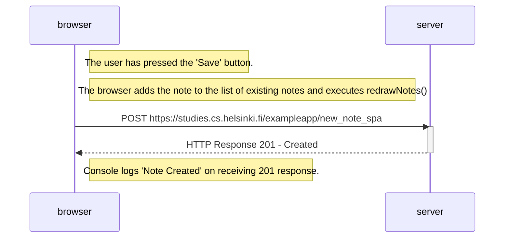

```mermaid
sequenceDiagram
    participant browser
    participant server
    
    Note right of browser: The user has pressed the 'Save' button.
    Note right of browser: The browser adds the note to the list of existing notes and executes redrawNotes()
    browser->>server: POST https://studies.cs.helsinki.fi/exampleapp/new_note_spa
    activate server
    server-->>browser: HTTP Response 201 - Created
    deactivate server

    Note right of browser: Console logs 'Note Created' on receiving 201 response.

```